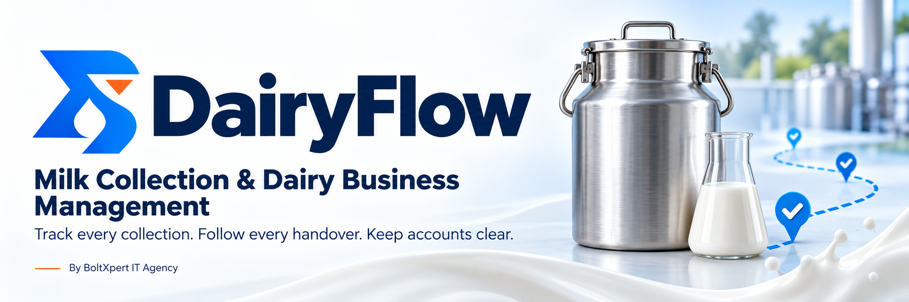

# DairyFlow — Milk Collection & Dairy Business Management Software

**Track every collection. Follow every handover. Keep accounts clear.**

Offline-first dairy management software for milk collection centers, suppliers and dairy businesses—connecting field collection, laboratory workflows, stock and finance.

[Download Apps](https://github.com/boltxpert/dairyflow-downloads/releases/latest) · [Request a Demo](https://wa.me/923133454060?text=Hello%2C%20I%20would%20like%20a%20DairyFlow%20demo.) · [Licensing & Pricing](https://wa.me/923133454060?text=Hello%2C%20please%20share%20DairyFlow%20licensing%20and%20pricing%20details.)

**Windows & Android** · **English & Urdu** · **Role-Based Access**

## From milk collection to buyer delivery

**Supplier → Collection Center → Mobile Tester → Lab → Certified Stock → Buyer**

Keep quantities, quality readings, batch references and receiving confirmations connected throughout the milk-handling workflow.

| DairyFlow Host | DairyFlow Client |
| --- | --- |
| Central business workspace for owners, partners, managers and accountants, with permission-based access for other roles. | Focused field workflows for Milk Collection Center Agents (MCCA), Milk Mobile Testers (MMT) and Lab Analysts. |

## Features for daily dairy operations

- **Milk collection & calculations:** supplier and self-milk records, volume, LR and fat readings, plus configurable SNF, TS and 13TS-equivalent calculations.
- **Batch tracking & handovers:** traceable collection, MCCA, MMT and Lab references with receiving confirmations and submission history.
- **Lab testing & milk stock:** record test findings, certification, rejection decisions, available stock and stock movements.
- **Supplier & buyer accounts:** approvals, purchase rates, buyer demands, dispatch, actual receiving, payments and account ledgers.
- **Milk variance & payroll:** track handover differences, authorized settlements, recovery milk, salary advances, deductions and payment history.
- **Reports & records:** operational dashboards, expenses, financial reports, permission-controlled audit logs and printable/PDF receipts.
- **Connected when available:** local-first Host operations, supported offline field drafts, and Host/Cloud synchronization with retry safeguards.

## Screenshots

| Business dashboard | Milk collection |
| :---: | :---: |
| *Screenshot coming soon* | *Screenshot coming soon* |
| **Lab testing & milk stock** | **Accounts & payroll** |
| *Screenshot coming soon* | *Screenshot coming soon* |

<!-- Replace placeholders after uploading demonstration screenshots.
Suggested paths: screenshots/dashboard.png, screenshots/milk-collection.png,
screenshots/lab-stock.png, screenshots/accounts-payroll.png.
Hide supplier/customer phone numbers, financial details and private credentials.
-->

## Download & get started

**Latest Android release: 1.1.1 · Build 11**

| Platform | Host | Client |
| --- | --- | --- |
| Android | [Download Host APK](https://github.com/boltxpert/dairyflow-downloads/releases/download/v1.1.1/DairyFlow-Host-1.1.1.apk) | [Download Client APK](https://github.com/boltxpert/dairyflow-downloads/releases/download/v1.1.1/DairyFlow-Client-1.1.1.apk) |
| Windows x64 | [Download Host Setup](https://github.com/boltxpert/dairyflow-downloads/releases/download/v1.1.0/DairyFlow-Host-Setup-1.1.0.exe) | [Download Client Setup](https://github.com/boltxpert/dairyflow-downloads/releases/download/v1.1.0/DairyFlow-Client-Setup-1.1.0.exe) |

Contact us for licensing and business setup, install the appropriate edition, then configure authorized users and device connections.

[Read installation and release details](https://github.com/boltxpert/dairyflow-downloads/releases/latest). The 1.1.1 Android APKs are production-signed. The 1.1.0 Windows installers are not code-signed and may trigger SmartScreen. Verify the source rather than bypassing security warnings blindly.

## Licensing, terms & responsible use

- **License-based software:** contact BoltXpert IT Agency for pricing, activation and the applicable agreement. Public downloads do not grant an open-source license or source-code rights.
- **Agreed terms apply:** device limits, license duration, support, renewal and any refunds must be confirmed in your quotation or agreement.
- **Offline scope:** supported local work can continue without Cloud availability. Activation, remote synchronization and submission workflows depend on the required authorized connection.
- **Business responsibility:** confirm measurement settings, laboratory decisions and financial entries. Software calculations do not replace testing procedures or regulatory obligations.
- **Protect your records:** maintain secure backups and synchronize pending work before updates. Ask support before uninstalling an app containing business data; never post credentials or private records publicly.

## Built by BoltXpert IT Agency

**Team Lead:** Asad Ullah · **Location:** Layyah, Pakistan

[WhatsApp: +92 313 3454060](https://wa.me/923133454060) · [Email: support@boltxpert.com](mailto:support@boltxpert.com)

**Bring clarity to your milk collection and dairy accounts. [Request a DairyFlow demo.](https://wa.me/923133454060?text=Hello%2C%20I%20would%20like%20a%20DairyFlow%20demo.)**
